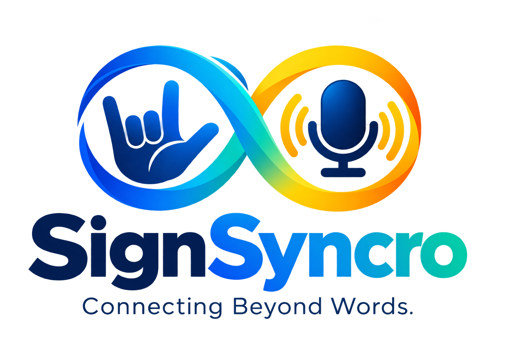

<div align="center">



# SignSyncro

### Connecting Beyond Words.

AI-powered two-way assistive communication through **Sign • Text • Speech**

---

</div>

## About SignSyncro

**SignSyncro** is an intelligent assistive communication system designed to bridge communication barriers between sign-language users and non-sign-language users. Built around a seamless two-way interaction paradigm, SignSyncro enables real-time fluid conversation across multiple modalities: **Sign, Text, and Speech**.

### Core Communication Directions

```
 ┌─────────────────────────────────────────────────────────────┐
 │                Sign → Text → Speech Direction              │
 └─────────────────────────────────────────────────────────────┘
  Camera Input  ──►  Gesture Recognition  ──►  Text Generation  ──►  Speech Output
  (User Signs)       (YOLO & CV Pipeline)      (Sentence Engine)      (Web Speech Synthesis)

 ┌─────────────────────────────────────────────────────────────┐
 │                Speech → Text → Sign Direction              │
 └─────────────────────────────────────────────────────────────┘
  Microphone Input ──► Speech-to-Text      ──► Sentence Structuring ──► Visual Sign Performance
  (Person Speaks)     (Web Speech Recognition) (Gloss Pipeline)        (ISL Image Visualizer)
```

---

## Features

- **Real-Time Sign-to-Text Recognition**: High-speed camera gesture recognition converting ISL signs into text tokens.
- **Speech-to-Text Input**: Real-time microphone audio transcription using native speech recognition.
- **Speech-to-Sign Visual Performance**: Renders sequenced Indian Sign Language (ISL) visual cards/performances for spoken sentences.
- **Smart Sentence Engine**: Normalizes recognized sign tokens into natural, grammatically coherent English sentences.
- **Text-to-Speech Output**: Instant audio synthesis for generated text responses.
- **Interactive Conversation Mode**: Two-way chat timeline supporting both deaf/hard-of-hearing and hearing participants.
- **Quick Needs Accessibility**: One-touch essential phrase shortcuts for rapid emergency and daily communication.
- **Transcript History**: Exportable conversation history and session logs.
- **My Signs Vocabulary**: Searchable reference gallery for supported sign gestures.
- **Modern Responsive UI**: Dark-mode glassmorphism interface with intro animations and micro-interactions.

---

## Tech Stack

- **Frontend**: HTML5, CSS3 (Vanilla Glassmorphism UI), JavaScript (ES6+), FontAwesome 6, Google Fonts (Outfit / Plus Jakarta Sans)
- **Backend**: Python 3.10+, Flask
- **Computer Vision & AI**: OpenCV, Ultralytics YOLOv8 (`yolov8n.pt`), Custom Gesture Classification Pipeline
- **Speech & Audio**: Web Speech API (SpeechRecognition & SpeechSynthesis)
- **Version Control**: Git, GitHub

---

## Project Architecture

```
                                  ┌────────────────────────┐
                                  │      User Inputs       │
                                  └───────────┬────────────┘
                                              │
                       ┌──────────────────────┴──────────────────────┐
                       ▼                                             ▼
            [Camera Video Feed]                            [Microphone Audio]
                       │                                             │
                       ▼                                             ▼
          Computer Vision Pipeline                        Web Speech API
    (OpenCV + YOLO Gesture Detector)                  (Speech-to-Text Processor)
                       │                                             │
                       ▼                                             ▼
              Recognized Tokens                            Transcribed Text
                       │                                             │
                       ▼                                             ▼
               Sentence Engine                             ISL Gloss Mapping
     (Token Normalization & Grammar)                 (Vocabulary Index Search)
                       │                                             │
                       ▼                                             ▼
            Formatted Text Message                          Visual Sign Cards
                       │                                    & Animation Sequence
                       ▼                                             │
               Speech Output                                         │
          (Text-to-Speech Synth)                                     │
                       │                                             │
                       └──────────────────────┬──────────────────────┘
                                              │
                                              ▼
                                 ┌────────────────────────┐
                                 │ Conversation Interface │
                                 └────────────────────────┘
```

---

## Project Structure

```
SignSync/
│
├── app.py                     # Primary Flask application server & API routes
├── camera.py                  # OpenCV camera capture and frame streaming handler
├── config.py                  # Application configuration settings
├── gesture_detection.py       # YOLOv8 gesture recognition module
├── sentence_engine.py         # Sign token to English sentence generator
├── emotion_detection.py       # Emotion classification module
├── fusion.py                  # Multimodal sensor fusion engine
├── benchmark_accuracy.py      # System evaluation script
├── main.py                    # Server launcher
├── run.bat                    # Windows quick-start launcher script
├── requirements.txt           # Python dependencies list
├── .env.example               # Environment variables template
├── .gitignore                 # Git ignored files configuration
├── README.md                  # Project documentation
│
├── models/                    # Model binary storage directory
│   ├── face_landmarker.task
│   ├── gesture_recognizer.task
│   └── hand_landmarker.task
│
├── static/                    # Frontend static assets
│   ├── css/
│   │   └── style.css          # Core styles & glassmorphism theme
│   ├── js/
│   │   └── main.js            # Frontend logic, routing & speech integration
│   └── img/
│       ├── signsyncro_logo.png  # Official SignSyncro logo asset
│       ├── favicon.png        # Web favicon asset
│       └── avatar_isl/        # ISL sign language visual card assets
│
└── templates/                 # HTML templates
    └── index.html             # Single-Page Application view
```

---

## Setup Instructions

### Prerequisites
- Python 3.10 or higher
- Modern web browser (Google Chrome or Microsoft Edge recommended for full Web Speech API support)
- Webcam and Microphone permissions

### Installation Steps

1. **Clone the Repository**
   ```bash
   git clone https://github.com/apoorva-6575/SignSync.git
   cd SignSync
   ```

2. **Create and Activate Virtual Environment**
   - **Windows:**
     ```cmd
     python -m venv venv
     venv\Scripts\activate
     ```
   - **macOS / Linux:**
     ```bash
     python3 -m venv venv
     source venv/bin/activate
     ```

3. **Install Dependencies**
   ```bash
   pip install -r requirements.txt
   ```

4. **Set Up Environment Variables**
   ```cmd
   copy .env.example .env
   ```

5. **Run the Application**
   ```cmd
   python app.py
   ```
   *Alternatively, on Windows double-click `run.bat` or run `python main.py`.*

6. **Access SignSyncro**
   Open your browser and navigate to: `http://127.0.0.1:5000`

---

## Usage Guide

1. **Launch App**: Open `http://127.0.0.1:5000` in your web browser.
2. **Navigate to Communicate**: Click on **Communicate** in the navigation bar.
3. **Grant Permissions**: Allow camera and microphone access when prompted by the browser.
4. **Sign → Text → Speech Mode**:
   - Pose gestures in front of the camera.
   - Verified sign tokens will be recognized and rendered into coherent text sentences.
   - Click **Speak Sign** to output natural speech audio.
5. **Speech → Text → Sign Mode**:
   - Click **Hold to Speak** or type in the input bar.
   - Speak clearly into the microphone.
   - Transcribed text is processed into corresponding ISL sign cards and visual sequence animations.
6. **Quick Needs**: Use one-click shortcuts for essential phrases like *Help*, *Water*, or *Thank You*.

---

## Technical Details

### Sign → Text → Speech
1. Video frames captured via OpenCV webcam feed (`camera.py`).
2. Objects and hand gestures detected in real-time using YOLOv8 (`gesture_detection.py`).
3. Extracted gesture tokens sent to the sentence engine (`sentence_engine.py`) to build complete sentences.
4. Generated text fed into browser native Web Speech API for optional audio synthesis.

### Speech → Text → Sign
1. Spoken input transcribed into text via browser `SpeechRecognition`.
2. Text normalized and parsed into key ISL gloss tokens (`main.js`).
3. Matched gloss tokens mapped to high-definition ISL gesture card assets stored in `static/img/avatar_isl/`.
4. Visual sequence rendered frame-by-frame on screen for deaf or hard-of-hearing users.

---

## Future Scope

- **3D Interactive Avatar**: Replacing 2D visual cards with a fully animated 3D sign language avatar.
- **Dynamic Gesture Recognition**: Support for continuous video gesture streams beyond static signs.
- **Expanded ISL Dictionary**: Increasing vocabulary coverage from foundational phrases to full dictionary support.
- **Mobile & Edge Deployment**: Android/iOS applications and lightweight edge camera device support.
- **Wearable Integration**: SignSyncro Wear compatibility with smart glasses and wearable cameras.

---

## Project Status

**Current Status**: `Working Prototype / Active Development`

---

## Author

**Apoorva Kala**  
B.Tech Computer Science Engineering  
Manipal University Jaipur
